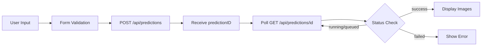

# Frontend Documentation

## Technology Stack

### Core Technologies
- **Framework**: Next.js 15.5 (App Router)
- **Runtime**: React 19
- **Language**: TypeScript
- **Styling**: Tailwind CSS 4.x with shadcn/ui components
- **Form Management**: React Hook Form 7.x with Zod validation
- **API Client**: TanStack Query for data fetching and mutations
- **Icons**: Lucide React

## Component Architecture

### Main Page (`apps/web/app/page.tsx`)
- **Type**: Server Component
- **Purpose**: Landing page with modular sections (Header, Hero, Features, etc.)
- **Structure**: Composed of multiple landing page sections

### Logo Maker Component (`apps/web/components/logo-maker.tsx`)
- **Type**: Client Component (`"use client"`)
- **Purpose**: Core application logic for logo generation
- **State Management**: Local React state with useState
- **Form Management**: React Hook Form with Zod validation

## Data Flow



## Form Schema & Validation

The form implements strict validation using Zod:

```typescript
{
  appName: string (min 2 chars)
  appFocus: string (min 3 chars)
  color1: string (min 2 chars)
  color2: string (min 2 chars)
  model: string (required)
  outputCount: string (required)
}
```

## UI Components

### Form Components
- **Input**: For text inputs (app name, focus, colors)
- **Select**: For model selection and output count
- **Button**: For form submission and actions
- All components are from shadcn/ui with custom styling

### Layout Components
- **Card**: Container for the logo maker form
  - CardHeader: Title and description
  - CardContent: Form fields
  - CardFooter: Results display

### Feedback Components
- **Skeleton**: Loading states for image placeholders
- **RainbowButton**: Animated CTA button for generation
- **Alert**: Error and status messages

### Icon Usage
- **FileText**: For app name input
- **ImageIcon**: For app focus input
- **Wand2**: For generate button
- **Download**: For download buttons
- **Coins**: For credit balance display

## State Management

### Local Component State
- `generationCount`: Number of images to display during loading
- `predictionId`: Current prediction being tracked
- `errorMessage`: Displayed error messages
- `errorType`: Type of error for specific handling
- `pollDeadlineRef`: Timer ref to prevent infinite polling

### Form State
- Managed by React Hook Form with Zod resolver
- Tracks all form field values and validation states
- Provides automatic validation feedback

### Query State
- `useMutation` for creating predictions
- `useQuery` for polling prediction status
- Automatic cache invalidation when needed

## API Integration

### Prediction Creation
1. Form submission triggers POST to `/api/predictions`
2. On success, starts polling for status updates
3. Deducts credits and updates balance display

### Status Polling
1. Polls `/api/predictions/{id}` every 2 seconds
2. Continues while status is "queued" or "running"
3. Stops when status is "success" or "failed"
4. Times out after 5 minutes

## Styling Approach

### Tailwind CSS
- **Utility-first**: Most styling done with Tailwind classes
- **Custom configuration**: Project-specific design tokens
- **Dark mode**: Automatic theme support with next-themes

### Component Customization
- **shadcn/ui base**: Uses base components with custom styling
- **Theme consistency**: Consistent color palette and spacing
- **Responsive design**: Mobile-first responsive approach

## Performance Optimizations

### Loading States
- **Skeleton loading**: Visual feedback during API calls
- **Image optimization**: Next.js Image component with priority loading
- **Progressive enhancement**: Form remains usable during loading

### Caching
- **TanStack Query**: Client-side caching and background updates
- **Image caching**: Browser caching for generated images
- **Form state persistence**: Browser's form state restoration

## User Experience Patterns

### Error Handling
- **Form validation**: Client-side validation with clear error messages
- **API error handling**: Clear, actionable error messages
- **Retry mechanisms**: Options to retry failed operations

### Loading States
- **Progressive feedback**: Visual indicators for ongoing operations
- **Optimistic updates**: UI updates before API confirmation where appropriate
- **Timeout handling**: Clear feedback when operations take too long

## Credit System Integration

### Balance Display
- Real-time credit balance display
- Visual indicators for low credit amounts
- Direct access to credit purchase flow

### Credit Validation
- Pre-submission validation against available credits
- Automatic error handling for insufficient credit scenarios
- Balance refresh after successful transactions