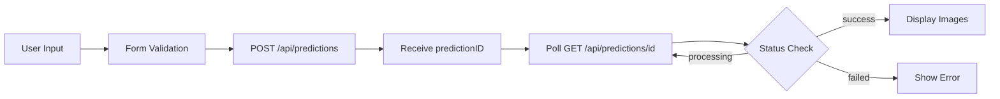

# LogoLoco - Next.js Project Documentation

## 1. Project Overview

### Stack Summary
- **Framework**: Next.js 15.5.6 (App Router)
- **Runtime**: Node.js
- **Language**: TypeScript 5.x
- **Styling**: Tailwind CSS 4.x with custom components
- **UI Library**: Radix UI primitives with custom shadcn/ui components
- **Form Handling**: React Hook Form 7.66.1 with Zod validation
- **Package Manager**: Bun (based on bun.lock presence)

### Application Type
A **SaaS AI-powered logo generation application** that allows users to create professional logos for their businesses using multiple AI models.

### Key Features
- Multi-model AI logo generation (3 models: Nano Banana, Seedream v4, Reve Text)
- Real-time generation status tracking
- Turkish language interface
- Color-based logo generation with gradient support
- Batch image generation (up to 4 images at once)
- Download functionality for generated logos

### Architecture Overview
- **Frontend**: React 19.1.0 with Server Components
- **Backend**: Next.js API routes handling AI model integration
- **External Services**: Eachlabs AI API for image generation
- **State Management**: Local component state with React hooks
- **Data Fetching**: Client-side fetch with polling for status updates

---

## 2. API Registry

### Base Configuration
- **API Base Path**: `/api`
- **External API**: `https://api.eachlabs.ai/v1/prediction/`
- **Authentication**: API key-based (X-API-Key header)

### Endpoints

#### POST /api/predictions
**Purpose**: Create a new logo generation prediction

**Request**:
```typescript
{
  appName: string      // Application name (min 2 chars)
  appFocus: string     // Application focus/theme (min 3 chars)
  color1: string       // Primary color
  color2: string       // Secondary color
  model: string        // Model selection: "nano-banana" | "seedream-v4" | "reve-text"
  outputCount: string  // Number of images to generate: "1" | "2" | "3" | "4"
}
```

**Response**:
```typescript
{
  predictionID: string  // Unique prediction identifier
}
```

**Model-Specific Parameters**:
- **nano-banana**:
  - output_format: "png"
  - aspect_ratio: "1:1"
  - limit_generations: true
- **seedream-v4**:
  - image_size: "square_hd"
  - enable_safety_checker: true
- **reve-text**:
  - aspect_ratio: "1:1"
  - output_format: "png"

**Error Responses**:
- 400: Invalid model selected
- 500: EACHLABS_API_KEY not configured
- 500: Internal server error

#### GET /api/predictions/[id]
**Purpose**: Retrieve prediction status and results

**Path Parameters**:
- `id`: Prediction ID from creation endpoint

**Response**:
```typescript
{
  status: "processing" | "success" | "failed" | "error"
  output?: string | string[]  // Generated image URLs (on success)
  error?: string              // Error message (on failure)
}
```

**Error Responses**:
- 500: EACHLABS_API_KEY not configured
- 500: Internal server error

---

## 3. Frontend Usage Matrix

### Component Architecture

#### Main Page (`app/page.tsx`)
- **Type**: Server Component
- **Data Fetching**: None (static content)
- **Purpose**: Landing page with title and LogoMaker component embedding

#### LogoMaker Component (`components/logo-maker.tsx`)
- **Type**: Client Component (`"use client"`)
- **Location**: Main application logic
- **State Management**: Local React state with useState
- **Form Management**: React Hook Form with Zod validation

### Data Flow



### API-to-Component Mapping

| Component | API Endpoint | Method | Purpose |
|-----------|-------------|---------|---------|
| LogoMaker | `/api/predictions` | POST | Create new prediction |
| LogoMaker | `/api/predictions/[id]` | GET | Poll for results |

### Form Schema & Validation
```typescript
{
  appName: string (min 2 chars)
  appFocus: string (min 3 chars)
  color1: string (min 2 chars)
  color2: string (min 2 chars)
  model: string (required)
  outputCount: string (required)
}
```

### UI Components Used
- **Form Components**: Input, Select, Button
- **Layout**: Card, CardHeader, CardContent
- **Feedback**: Skeleton (loading), RainbowButton (CTA)
- **Icons**: Lucide React icons

---

## 4. Authentication Details

### Current Status
**No authentication system implemented**

The application currently operates without user authentication:
- No user accounts or sessions
- No protected routes or API endpoints
- API key authentication only for external Eachlabs API
- All functionality is publicly accessible

### Security Configuration
- **Environment Variable**: `EACHLABS_API_KEY` (required)
- **API Key Usage**: Server-side only, never exposed to client
- **CORS**: Default Next.js CORS configuration
- **Rate Limiting**: None implemented

---

## 5. ORM & Database Summary

### Current Status
**No database or ORM integration**

The application operates in a stateless manner:
- No data persistence
- No user data storage
- No generation history tracking
- All data is ephemeral and session-based

### Data Storage
- Generated images are stored on external Eachlabs servers
- Image URLs are returned to the client
- No local storage or caching implemented

---

## 6. Payments Integration Summary

### Current Status
**No payment system implemented**

The application currently has:
- No payment processing
- No subscription management
- No usage limits or quotas
- Free access to all functionality

---

## 7. Middleware & Request Flow

### Request Pipeline
```
Client Request → Next.js Router → API Route Handler → Eachlabs API → Response
```

### Error Handling
- API routes include try-catch blocks
- Graceful error responses with appropriate status codes
- Client-side error display through UI state

### Performance Optimizations
- Turbopack enabled for development and build
- Component-level code splitting
- Font optimization with Next.js font loading

---

## 8. Security & Access Controls

### Current Security Posture

#### Strengths
- API key stored in environment variable
- Server-side API communication only
- Input validation with Zod schemas
- No sensitive data stored

#### Areas for Improvement
- No rate limiting implemented
- No request signing or CSRF protection
- No input sanitization beyond type validation
- No audit logging

### Recommendations
1. Implement rate limiting for API endpoints
2. Add request validation middleware
3. Implement proper error logging
4. Consider adding user authentication for production
5. Add usage quotas and monitoring

---

## 9. Performance Analysis

### Current Performance Characteristics

#### Strengths
- Turbopack optimization enabled
- Minimal bundle size (no heavy dependencies)
- Efficient polling mechanism with 2-second intervals
- Component-based code splitting

#### Bottlenecks
- Synchronous polling could be optimized with WebSockets
- No caching of generated images
- No CDN integration for static assets
- No image optimization for generated logos

### Optimization Opportunities
1. Implement WebSocket for real-time status updates
2. Add Redis caching for prediction status
3. Implement image CDN for generated logos
4. Add progressive image loading
5. Consider implementing service workers for offline support

---

## 10. External Integrations

### Eachlabs AI API
- **Purpose**: AI-powered logo generation
- **Models Available**:
  - Nano Banana: Fast, minimalist designs
  - Seedream v4: High-quality, detailed images
  - Reve Text: Text-focused logo generation
- **Authentication**: API key-based
- **Endpoints Used**:
  - POST `/v1/prediction/` - Create prediction
  - GET `/v1/prediction/{id}` - Get status

### Dependencies Overview
- **UI Framework**: Radix UI components
- **Styling**: Tailwind CSS with custom configuration
- **Forms**: React Hook Form + Zod
- **Animations**: Tailwind animations
- **Icons**: Lucide React

---

## 11. Development & Deployment

### Scripts
```json
{
  "dev": "next dev --turbopack",
  "build": "next build --turbopack",
  "start": "next start",
  "lint": "eslint"
}
```

### Environment Configuration
Required environment variables:
```bash
EACHLABS_API_KEY=your_api_key_here
```

### File Structure
```
/
├── app/
│   ├── api/
│   │   └── predictions/
│   │       ├── route.ts          # Create prediction
│   │       └── [id]/
│   │           └── route.ts      # Get prediction status
│   ├── layout.tsx                # Root layout
│   ├── page.tsx                  # Home page
│   └── globals.css               # Global styles
├── components/
│   ├── logo-maker.tsx           # Main app component
│   └── ui/                      # Reusable UI components
├── lib/
│   └── utils.ts                 # Utility functions
└── docs/
    ├── prd.md                   # Product requirements
    └── eachlabs/                # Model documentation
```

---

## 12. Future Enhancements

### Recommended Improvements
1. **Authentication System**: Add user accounts and session management
2. **Database Integration**: Store generation history and user preferences
3. **Payment System**: Implement credits or subscription model
4. **Enhanced UX**: Add preview, editing, and variation features
5. **Analytics**: Track usage patterns and popular configurations
6. **Internationalization**: Expand beyond Turkish language
7. **API Rate Limiting**: Protect against abuse
8. **Caching Strategy**: Implement Redis for better performance
9. **WebSocket Integration**: Real-time status updates
10. **Progressive Web App**: Offline support and installability

### Technical Debt
- Add comprehensive error boundaries
- Implement proper logging system
- Add unit and integration tests
- Improve TypeScript type coverage
- Add API documentation (OpenAPI/Swagger)
- Implement CI/CD pipeline

---

## API Inventory (CSV Format)

| Endpoint | Method | Auth Required | Request Type | Response Type | Used By |
|----------|--------|--------------|--------------|---------------|---------|
| /api/predictions | POST | No | JSON | JSON | LogoMaker |
| /api/predictions/[id] | GET | No | None | JSON | LogoMaker |

---

## Conclusion

LogoLoco is a modern Next.js 15 application leveraging the App Router pattern for a streamlined AI-powered logo generation service. While currently minimal in scope (no auth, database, or payments), it demonstrates clean architecture with clear separation of concerns and modern React patterns. The application is production-ready for its current feature set but would benefit from the recommended enhancements for a full commercial deployment.
